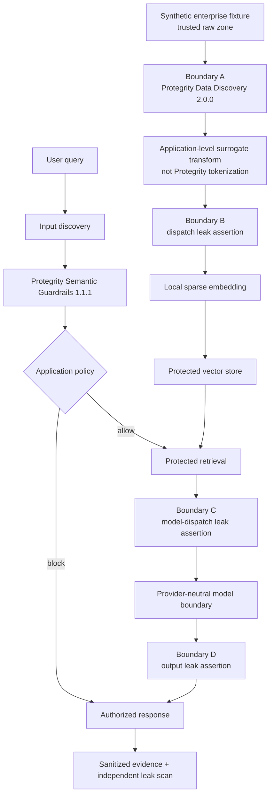

# Architecture

## Trust boundaries

## Causal Protegrity use

`ProtegrityDiscoveryClient` calls the documented Data Discovery HTTP API. Its returned spans determine which source substrings are replaced; absent or malformed trustworthy classification causes a fail-closed error instead of raw forwarding.

`ProtegritySemanticGuardrailClient` calls the documented Semantic Guardrails conversation API with the pinned `customer-support` processor. The pinned API's authoritative batch outcome is normalized to `ALLOW` or `BLOCK` and causally determines whether retrieval and model dispatch may proceed. Scores and labels remain evidence for inspection; they are not reinterpreted as a universal prevention claim. A local score threshold is used only as a compatibility fallback if a future response omits the outcome field, and that fallback is visible in evidence.

The deterministic provider classes exist only for fast reproducible contract and security tests. Evidence records whether a real vendor component or test double produced each result.

## Protection stages

| Stage | Sensitive-data control | Independent proof |
|---|---|---|
| Ingestion | Data Discovery plus application surrogate replacement | Detected entity classes and canary scan |
| Embedding/storage | Exact assertion before embedding; non-sensitive metadata allowlist | Vector text and metadata scan |
| Retrieval/inference | Protected-only retrieval and exact pre-dispatch assertion | Dispatch/context canary scan |
| Output/observability | Output and evidence assertions | File-level leak scan and evidence hashes |

## Fail-closed rule

Provider timeout, connection error, malformed result, absent classification on a record known to contain sensitive data, or any canary match raises a typed error before downstream storage or dispatch. There is no raw fail-open route.

## Utility plane

Business facts such as service tier, account state, support case, and required policy action survive protection. Expected facts are evaluated independently from the security result. Qualification requires both.
